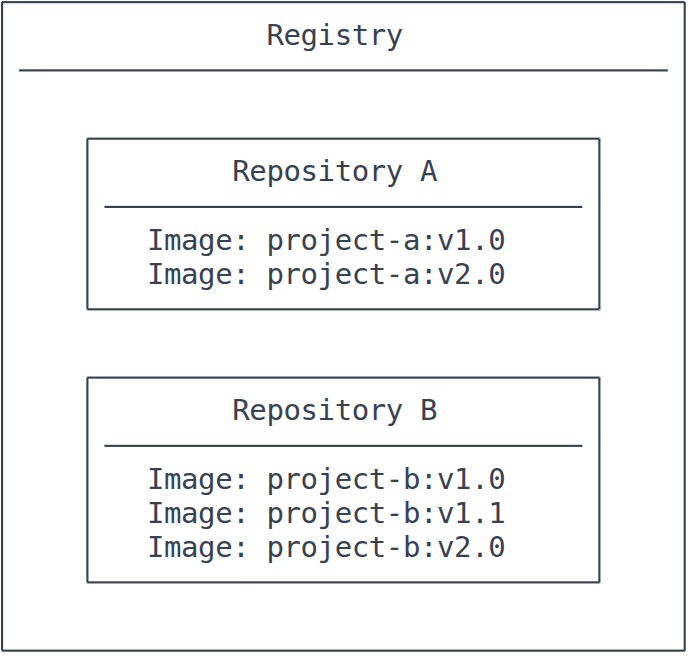
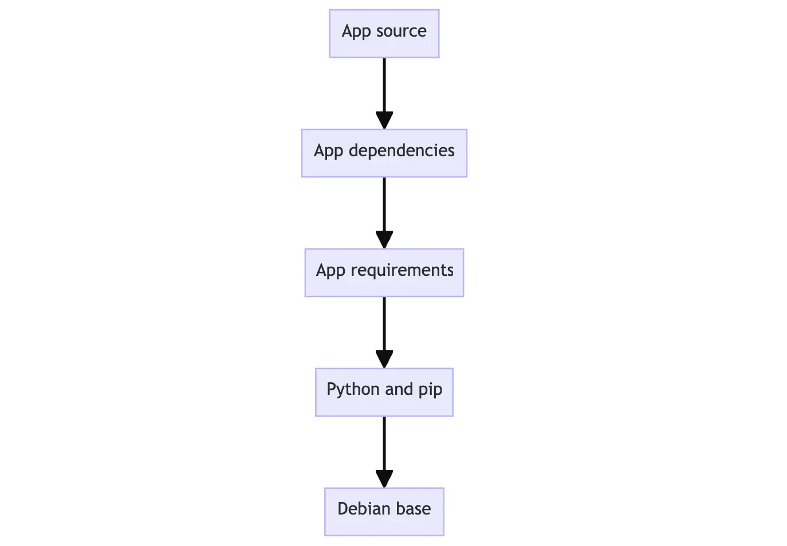

# Nginx

Nginx is a seerver, load balancer, reverse proxy and email server. It can be used for a lot of things, but i am using it for serving static content for my livekit to run.

Nginx is composed of one main process and various other workers processes. The first one is responsible for reading and mantaingnng the configuration and to set the correct number of workers. The seconds, are the ones actually serving the content.
Nginx employs events based omdels and OS-dependant mechanism to ensure the correct load balancer between workers.

Number of workers is defined in the configuration file or limited automatically by the number of cores in the CPU.

## Starting stopping and reading the config
For starting nginx, we just run the executable. THe configuration lives in /etc/nginx/nginx.conf in nginx version nginx/1.29.8.

nginx               -> Starts
nginx -s quit       -> Shutdown the server
nginx -s reload     -> Reload the configuration file

## Configuration file
It normally lives in /etc/nginx/nginx.conf.

### Structure
Nginx is based on modules, which are controlled by directives. We can use simple directives, the one liners configurations that ends with a semicolon and the block directives that are controled in { }. A block directive can have more block directives inside.

The directives have context. In this example: the user and http are in the main context and the server is in the http context. The lines statign with # are comments
```
user user;

# My server
http {
    server{
    }
}
```
## Serving static content

Static files can easily be served using nignx locations and http server. Depending on the request, the file will be served in different directories.

We can follow the exmaple.
The configuration file normally hace severlab server block, depending on the port they are listening to or server names. Once nginx decides which server processes a request, it tests the URI specified in the request’s header against the parameters of the location directives defined inside the server block.

http{
    server{
    }
}


Then we can add the location block to the server block:
```
location / {
    root /data/www
}
```

Location block specifies the "/" prefix. That prefix is compared with the URI from the request. If a request matches with that "/" it will be added to the root directory in the local system. 
Example: if a request arrives wanting to fetch /index.html, the URI will match with / and nginx will try to serve the file in the /data/www/index.html

Next: adding another second location block
localtion /images/ {
    root /data
}

That will match with URIs requesting /images/cat.png and the local system will be looking at /data/images/cat.png

It will be a match for requests starting with /images/ (location / also matches such requests, but has shorter prefix).

**CRITICAL** Lots of locations can match with the URI but ONLY the biggest match will be served.

I have achieved to understand nginx and how to serve statinc content with the server and i have been able to use the clien page that i used.

### Custom configuration file

I have been thinking if the cofig file can be writen in order to specify all , it seems that the food convention is to have a custom config file for the "site" but use the default one and that default to import the custom one. with include <route>.

THis is the way for docker and will be used continousely.

# DOCKER
## Registry
A registry is a centralized locatoin that stores and manages container imageages, whereas a repository is a collection of related container images within a registry. Think of it as a folder where you organize your images based on projects. Each repository contains one ore more conatinaer images.


## Docker compose
Docker compose is a declarative tool that configures a multi container applicaction in a single yaml file. It can be used for declaring netwroks within the docker containers and to run all the containers at once.

**Dockerfile vs compose file** Dockerfile provide instructions to build a container image whiloe compose define your running container. Quite often the compose file reernces a Dockerfile to build an image to use for a particular service.

# Building images
Managing our images is complicated, the  iamges should be small and very well for security purposes.

## Understanding image layers

Images are composed by layers. Those layers are esentially addings, deletions or modifications of the filesystem.
Each of these layer adds more capabilities to the file system.
A theorical image has this layers (example):

- Layer 1: adds basic comands of the selected OS and a package manager such apt.
- Layer 2: adds a python runtime and a pip for dependency management
- Layer 3: copies the in an application's spsecific requitements.txt
- Layer 4: installs the requirements txt
- Layer 5: copies in the actual source code.

That is beneficial so every layer can be reused in other images so the build time is reduced.
Layers let your docker only choose what is needed to run the application.

## Understanign how stackering the layers work

Layering is made posible by content-adredressable sotrage and union filesystems. How it works:
1. After each layer is downloaded, it is extracted into its own host filesystem.
2. When you create an image, a unified filesystem its created where every layer is stacked boave each other creating an unified biew.
3. When the container starts, the root of the filesustem is set to the root of the unified filesystem.

Example 
```bash
# L1
docker run  --name=base-container -ti ubuntu

#L2
apt update  && apt install -y nodejs

# Commit the layer to add the node layer, so you can start other containers with that image
docker container commit -m "Add node" base-container node-base

# Now you can run the commited image
docker run --name=app-container -ti node-base

# Now we can run this
docker run node-base node -e "console.log('Hello again')"

# And add create a node program
echo 'console.log("Hello")' >> app.js

# Configure a default command to the app and commit the image
docker commit -c "CMD node app.js" -m "Add app" node-app hello-app
```