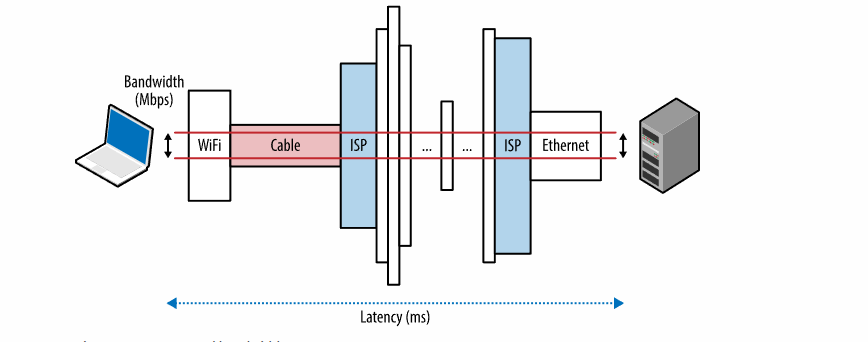
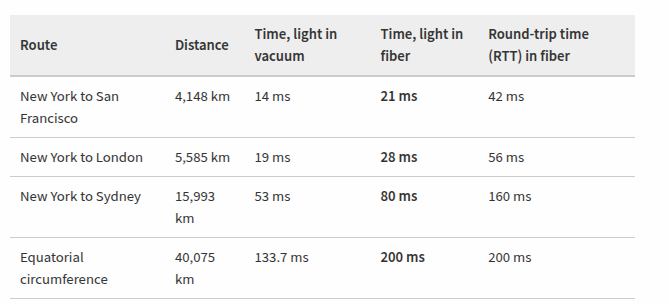
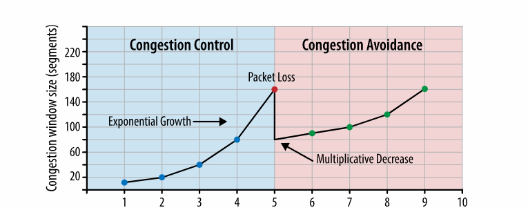
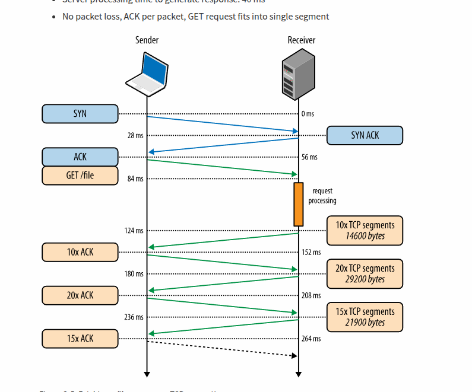
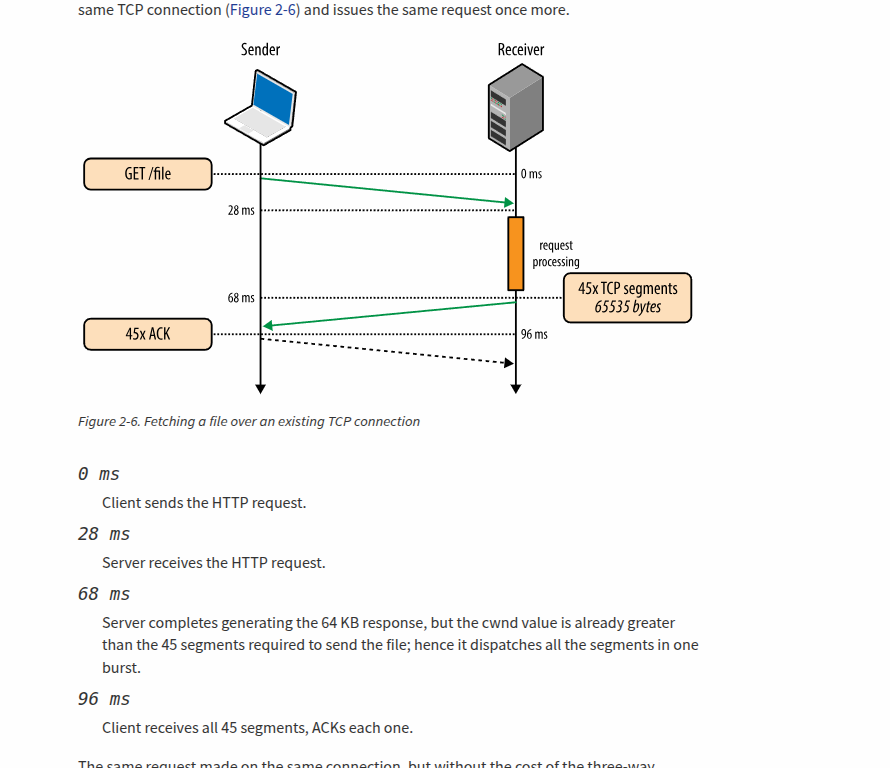
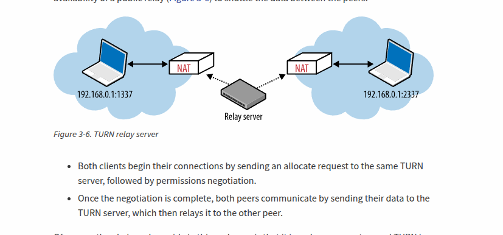
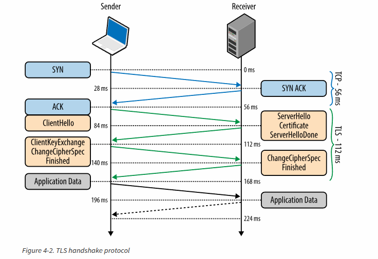

# Networks
Speed is a feature right now, is not a commodity. Speed leads to more user engagement, more conversions and better retention.
We will explore the two main factors of speed: latency and bandwith
- Latency is the time between sending a package and the receiver receiving it.
- Bandwith is the amount of data that con go through a physiscal/logical channel.


# Latency
THe latency definition is simple: time that pass between sending and receiving a packet. But that def is hiding some components that makes that latency up.
## Propagation delay
Amount of time required for the message to go from the sender to the receiver.f(distance,speed,signal)
## Transmission delay
Amount of time to push all the bits of the package into the physical lenght f(packagesize,dataRataLink)
## Processing delay
Amount of time to check the to handle the package's ehaders and decide route and bit errors.
## Queing delay
Amount of the time the package is waiting in the queue waiting for it to be pushed.

The total sum of those components is the latency.
So, if the distance is a lot, propagation delay will be affected. If we encounter a lot of routes along the way, transimission and processing delay will go up and if we encounter a lot of traffic, we may encounter our packet being queued at some point.

# Speed and propgation latency
As Einstain said, the max speed enery can travel is light. Light is a hard limit, but is high. The problem is that light's vlocity can only be achieved in a vacuum. But out packet travels in cober. The ratio between the info travels in light speed and the material   is called index of the material. So refractiveindex=lightSpeed/materialSpeed. The largeer the value the more the friction of that material, the slower it travels.

The refractive index of a fiber is ~1.5 so we are traveling at 2000000 meters per second.


## Last mile latency
Even if the speed with fiber is often fast, the last mile latency is usually what is making our apps feels slow. In the last mile is normally used to use another material and the package arrives to a provider of wifi. 
```bash
  $> traceroute google.com
  traceroute to google.com (74.125.224.102), 64 hops max, 52 byte packets
   1  10.1.10.1 (10.1.10.1)  7.120 ms  8.925 ms  1.199 ms 
   2  96.157.100.1 (96.157.100.1)  20.894 ms  32.138 ms  28.928 ms
   3  x.santaclara.xxxx.com (68.85.191.29)  9.953 ms  11.359 ms  9.686 ms
   4  x.oakland.xxx.com (68.86.143.98)  24.013 ms 21.423 ms 19.594 ms
   5  68.86.91.205 (68.86.91.205)  16.578 ms  71.938 ms  36.496 ms
   6  x.sanjose.ca.xxx.com (68.86.85.78)  17.135 ms  17.978 ms  22.870 ms
   7  x.529bryant.xxx.com (68.86.87.142)  25.568 ms  22.865 ms  23.392 ms
   8  66.208.228.226 (66.208.228.226)  40.582 ms  16.058 ms  15.629 ms
   9  72.14.232.136 (72.14.232.136)  20.149 ms  20.210 ms  18.020 ms
  10  64.233.174.109 (64.233.174.109)  63.946 ms  18.995 ms  18.150 ms
  11  x.1e100.net (74.125.224.102)  18.467 ms  17.839 ms  17.958 ms 
```
Latency, not bandwidth is the performance bottleneck for most websites. TO understand why we need to understand TCP and HTTP probocals.

# Bandwith in core networks
We use multiplexing in fiber so we can have different channels of connectivity in a single optic fiber cable.
As of early 2010, researchers have been able to multiplex over 400 wavelengths with the peak capacity of 171 Gbit/s per channel, which translates to over 70 Tbit/s of total bandwidth for a single fiber link! 

# Bandwith att the network edges
The cable of fiber it can handle a lot of data. The problem is that the edges of the cable cannot handle all that. Depending on wifi, performance of local routing.

# Delivering higher bandwith and less latency
It has been shown by researchers that we are just using 20% of the bandwith capacity of the fiber cabels among the world. And highering that bandwith should not be a major problem. The prpopblem is the latency, that is another problem.
With latnecy, yes, we can improve the material's quality but small improvemtn. We can reduce distance.
But the most imporatn one is optimize the perfomance of our applactions. Architext and optimize protcols and networking code. Move data closer to the cliend. Build apps that can hide lattency thorugh caching, prefetching and othAs a result, to improve performance of our applications, we need to architect and optimize our protocols and networking code with explicit awareness of the limitations of available bandwidth and the speed of light: we need to reduce round trips, move the data closer to the client, and build applications that can hide the latency through caching, pre-fetching, and a variety of similar techniques, as explained in subsequent chapters.

# BUILDING BLOCKS OF TCP

At the heart of the internet thare are two main protocol IP, that handles the routing in the networks and TCP that makes communication reliable in unreliable channels. TCP/IP is known as the suit.

TCP has not been changet since the 1981, there has been some improvementes but its core, abstraction of complexity and reliability has not changed. TCP assures that all the bytes arrives at the same order and all.

We will see some of the main features of the TCP, I am not going to work directly with TCP in my life, but knowing its features can increase web and app performance.

## Three way handshake

All TCP connections starts with the three way handshake. Before the client and the server start sending data they must choose a number to agree on starting packet sequence. Sequence numbers are chosen randomly
1. SYN: Client picks a random number and sends the number with some TCP options to the server
2. SYN ACK: server takes that number and picks another random one, it returns to the client x+1 and the new random
3. ACK: client sends y+1 x+1

After that, both client and server can start sending/receiving data from each one.

# Flow control
Mechanism to prevent the client to oveerwhelm the receiver with data it cannot process. It may be busy, a lot of load etc. For that, each side informs about the window(rwnd) wich communicate the avalible buffer space for the incoming data. It happens at the beggining and middle of the communication.

If one of the sides cannot keep up de rythim, it sends an smaller rwnd to the other to communicate to move slowly.

To address this, RFC 1323 was drafted to provide a "TCP window scaling" option, which allows us to raise the maximum receive window size from 65,535 bytes to 1 gigabyte! The window scaling option is communicated during the three-way handshake and carries a value that represents the number of bits to left-shift the 16-bit window size field in future ACKs.

## Slow start
Despite the control flow mechanism, netwrok connection was an issue. There was no mechanism to prevent either side from overwhelming the underlying network. No one knows the avaliable bandwidth at thebeginning of a new connection or adapt the sending information depending on circumstances.

After the three handshake starts the data exchange and th eonly way of knowing the congestion is by sending data.
To start, the server initilizes a new congestion window cwnd varible per TCP connections and sets the initial value to a conservative value.

Cwnd: sender side limit on the amount of data the sender can have in gligh before receibing an ackonlowdgmente (ACK) from the client. The cwnd is not a shared variable, is a private one in the server. 

Okay, so how can we change? The idea is to start slow, then, more segments can be sent. And if there is a packet loss, reduce the widnow.


So, now we know ehy our voice agents started slowly and then were converting the conversation in a more fluent one. It was about TCP all this time.





## Congestion avoidance
 Right now, packet loss is a feedback for activating more packages or not. It is not an if so a when. TCP startsmall and doubles the packages sent every time until it drops a packaeg, then, the cut is done. That is done several times in the connection.

 COngestion avoidance takes place right now and it is an actual academic research and commercial products research.

# Head of line blocking
TCP handles that all packages arrives in order, so TCP don't allow the app to receive packages before the before packages has been received

Emisor:    P1 → P2 → P3 → P4 → P5
Camino real con un paquete perdido por el camino:

Red:       P1 ✓
            P2 ✓
            P3 ✗  (perdido)
            P4 ✓
            P5 ✓

  ¿Qué hace TCP en el receptor?

  Aunque P4 y P5 ya están en el buffer del receptor, TCP NO los entrega a la aplicación
  hasta haber recibido P3. Mantiene "ordered delivery" como contrato sagrado.
# Bandwith Delay product
It signals how many data in bytes can be sending at max in a conextion   Bandwidth-Delay Product (BDP) = ancho de banda × delay (RTT).


# BUILDING BLOCKS OF UDP
UDP is a well known protocol known as null protocoll by all the features that not implements from TCP.
 
**Datagram** a self contained data block that has the necessary and minimum infromation for traveling to p2p without any other previous conneciton.

**Package vs datagram** -> Datagram is said by the data that is sent from a non reliable source, may be lost may be not.

UDP uses datagrams

The most well known use is DNS

# Null protocol services

UDP just adds four more fields to the IP protocol, and two of them are optional.

**No guarantee of message delivyer**, **No guarantee of order of delivyer**, **No connection state tracking**, **No congestion control.**

# NAT
Nat is the system for improving the quuantity of the necessary public IPs to sustain the world.

# NAT PROBLEM WITH UDP

UDP has no termiandon control so NAT tables that are saved in the router does not know when to delete those tables.
The solution for that is that both peers in the connection send packages that reset timers in the communicaters so the other know ( and the routers ) that the connection is still alive.
Even when TCP it is being used, this is used.

What happens with new NAT connections using UDP is that routers that use the NAT don't know the private IP, so the connection cannot be established.
For client server applicactions that is not a problem, but P2P such as games or VoIP is a problem.

# STUN
Session traversal utilities for NAT (STUN) is a protocal that allow the host application to discover the public IP and port fo r the current conection, to do so, the protocol requires assitance from a public positioned well known STUN server.
So a connection to private, it gives you the public IP of that so after it arrives to the cliente provider, it can handle to go to the private one.

1. The stun server is discoverd via DNS
2. The stun server gives you the public and port 
3. You con connect.

However, in practice STUN is not sufficient in all  regards and it is need a TURN

  El problema que STUN resuelve

  Recuerda lo que aprendimos de NAT:

  - Tu dispositivo tiene IP privada: 192.168.1.50.
  - Tu router tiene IP pública: 188.86.113.76.
  - El dispositivo NO sabe cuál es su IP pública desde dentro de su propia red.
  - Para hablar P2P con otro peer, necesitas decirle "puedes alcanzarme en X.Y.Z.W:puerto", pero tú mismo no sabes ese X.Y.Z.W:puerto.

  STUN es el mecanismo para que un dispositivo descubra su propia dirección pública preguntando a un servidor externo.

  Qué significa STUN
va


# TURN

It is a reliable system tsecundary from STUN, it is a server in the middle that handle both connections.




# TIPOS DE NAT

  Full Cone NAT

  Una vez Alice manda algo desde 192.168.1.50:54321, el NAT le asigna 1.1.1.1:60001. Cualquiera del mundo puede ahora mandarle a 1.1.1.1:60001 y llega a
   Alice. STUN trivial.

  Restricted Cone

  Igual, pero el NAT solo deja pasar tráfico de IPs a las que Alice ya envió algo antes. Si Alice mandó algo a Bob, solo Bob puede responder. STUN
  funciona — Alice manda primero, Bob responde, se conectan.

  Port-Restricted Cone

  Aún más estricto: solo deja pasar tráfico del IP y puerto exacto al que Alice envió. Si Alice mandó a Bob:6000, solo Bob:6000 puede responder, no
  Bob:6001. Pero STUN sigue funcionando porque Bob usa el mismo puerto consistentemente.

  Symmetric NAT (el problema)

  El NAT asigna un puerto público DISTINTO según el destino al que envías.

  - Alice manda a STUN-server:3478 → NAT le asigna pública 1.1.1.1:60001. STUN reporta a Alice "tu pública es 1.1.1.1:60001".
  - Alice manda a Bob:6000 → NAT le asigna pública distinta, 1.1.1.1:60002.

  Cuando Alice le dice a Bob "alcánzame en 1.1.1.1:60001" (basado en lo que STUN le dijo), Bob intenta enviar ahí. Pero 1.1.1.1:60001 solo está abierto
  para STUN-server, no para Bob. Paquete tirado.

  STUN reportó una dirección útil, pero la dirección útil cambia según el destino. STUN no puede predecir qué puerto el NAT asignará a Bob. P2P
  imposible.

  Solución: TURN — relay que actúa como destino único, así el NAT solo asigna un puerto y todo el tráfico fluye por ahí. A costa de bandwidth y latencia
   extra.


# TLS

TLS is a protocol that works above the trasnport layer. It has three services:
- Encryption
- Authentication Verify validity of provided identificacation material
- Integrity Mechanism to detect essage tampering and forgery

To make that posible TLS used a handshake to create the ciphersuites needed for encryption.  In the TLS, it allow the peers to authenticate itselfs, using the public key and not being able the attackers to attack using IP spoofing. The publick key is determined the secuty by dthe chain of trust and certified authorities. Then, all the messages of the TLS use the MAC algorithm one way hash to know that the message is the same, and that it has not changed. So the client can verify that MAC. The key used for negotiation is accepted and negotiated in the handshake.

# TLS Handshake

Before the client Before the client and the server can begin exchanging application data over TLS, the encrypted tunnel must be negotiated: the client and the server must agree on the version of the TLS protocol, choose the ciphersuite, and verify certificates if necessary. Unfortunately, each of these steps requires new packet roundtrips (Figure 4-2) between the client and the server, which adds startup latency to all TLS connections. server can start making meesages, the encç
