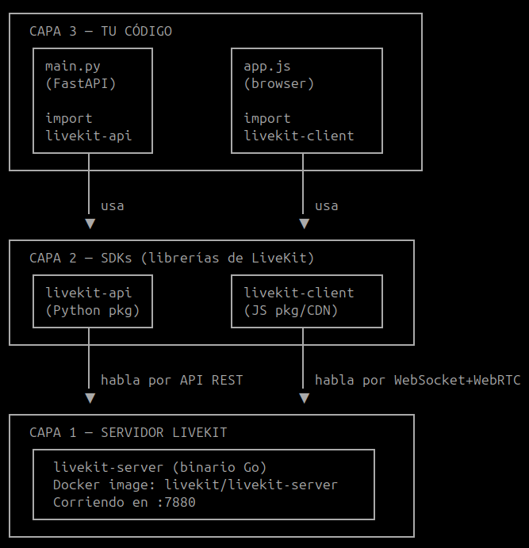

Livekit is a framework (abstracts complexity) that handles all things needed (transport, communication, build) for deploying agents and being able to handle conversation fluently with users.

Agents are workers that joins to rooms on livekit server that optimizes all the infra needed for quick and low latency communication.

For the web it is used the WedbRTC protocol, unlike HTTP that is designed for request-response acitons, it is optimized for streaming media (video and audio) in real time. WebRTC can handle bad connection alone, it is a hard protocol to work with but livekit abstracts that complexity for us.

## Just for calls?
Livekit is not just a framework for calling, it is a framework for communication and networks, I can handle different meetings, or communications with humnas and introduce ai in the loop, I can build more than just calls it is a form of creating network projects: SUPER EXCITING. I can do video conferncing just for humans I can build healthcare for just having that flow of data in my loop. Handle connection with robots. INCREDIBLE. Livekits just provides the abstraction and the foundation for realtime projects using both humans and ai agents.

## How livekit works?
Livekit architecture is supported by various components that work together:

### 1. Livekit server:
Is an opensource webRTC SFU ( selective forward unit ) that handles the media streaming and the .

#### SFU
Is a communication architecture with a server at the middle of the users that handles all the heacy lifting on the multiuser communication. It handles connectivity,NAT traversal is done by clients using STUN/TURN servers, not by the SFU directly., routing adaptative degradation. 
The difference with the mesh is that with the mesh one user had to encode and send the medio to all the users by itself, with SFU, the user just sends it to the server and it handles all the media and communication with the other users. This lowers the CPU usage (audio encoding) and bandwith by a lot.

The selective part: the sfu can select to wich user prioritize based on network conditions or if it is the active user.

### 2. Livekit agents framework
This is the framework wich can create agents choosing LLM TTS and STT with full modulatity, is high level. Agents can join rooms track media receive things. Just like another human. (CAN I HAVE TWO AGENTS MAKING A JOB INTERVIEW FOR EXAMPLE!)

### 3. SDKs and clients

This is the library wich is able to create rooms join to them and make users join to the room. Suscribe or unsuscribe to roooms Same sdk for both humans and agents.

─────────────┬──────────────┬───────────────────────────┬──────────┐
  │   Acción    │    Quién     │         Qué hace          │ Direcció │
  ├─────────────┼──────────────┼───────────────────────────┼──────────┤
  │ Publish     │ Participante │ Empieza a emitir su track │ Outbound │
  │             │  A           │  (cámara/micro) al SFU    │          │
  ├─────────────┼──────────────┼───────────────────────────┼──────────┤
  │ Unpublish   │ Participante │ Deja de emitir el track.  │ Outbound │
  │             │  A           │ Desaparece para todos.    │          │
  ├─────────────┼──────────────┼───────────────────────────┼──────────┤
  │             │ Participante │ Sigue publicado pero no   │          │
  │ Mute        │  A           │ envía datos (placeholder  │ Outbound │
  │             │              │ negro/silencio)           │          │
  ├─────────────┼──────────────┼───────────────────────────┼──────────┤
  │ Subscribe   │ Participante │ Recibe el track de A      │ Inbound  │
  │             │  B           │                           │          │
  ├─────────────┼──────────────┼───────────────────────────┼──────────┤
  │             │ Participante │ Deja de recibir el track  │          │
  │ Unsubscribe │  B           │ de A (A sigue publicando  │ Inbound  │
  │             │              │ para los demás)           │          │
  └─────────────┴──────────────┴───────────────────────────┴──────────┘

### 4. Integration services
Livekit integrates different communication methods like SIP or Egreess etc.

# Core concepts

Livekit being a realtime platform, is built around rooms, participants and tracks. Those are virtual spaces where participants (users and agents) connect and share media across the platform (or embeded) that we want.

## Rooms, participants and tracks
These three components inside the sdk are the ones wich have all the Livekit applications, most fundamental ones.

- **Room**: virtual space where all the participants are and where the communication happens.
    - Capabilites: delete create and list
- **Participants**: are the users, agents and services that joins a room.
    - Capabilituies: list remove and mute
- **Tracks**: are the media streaming where participants can suscribe and publish on.
    - Capabilities: videocamera, microphone and screen share tracks (publish and suscribe)

# Arquitectura 
Livekit is an individual server IS NOT A LIBRARY THAT I USE, is a server by itself running in a docker that manages rooms participants and all the connections.

Above that server, I can manage that server using my server code using sdk server with go so I can create roomns, manage participants and manage tracks (not for this week 0), we are delegating  all that runtime operations to the SFU that runs on our server.

# Docker

Why to use docker, don't have to complain about OS the machine. Machine is solated and have ALL it is need.

## Contanier

Is an isolated environment. Is like a mobile aplication. Apps are not affected by each other.

docker run <container> -> run the container.
docker ps               -> see the containers runnign
docker stop <contanier_id> -> stop a container

## Images
Is where all needed for running the applicaction, are standarized packages where lives all the code of your app.
Standareized packages where all the necessary (binaries, codes, files) things live for running your application.

You pull docker images and you can run it directly into a container.

1. Is inmmutable
2. Is made of layers -> create layers (you can build on top of that without managing those dependecnies)

IMAGES > CONTAINER

docker search docker/welcome-to-docker -> searches in the docker marketplace an image called welcome-to-docker
docker pull docker/welcome-to-docker -> pull an image 
docker image history docker/welcome-to-docker -> layers of an image

# MUST KNOWN COMMAND TO DOCKER
-v: <&PWD/<file.yaml>>:<path_in_docker>mount files into the image, being able to use the yaml on the image and llinkid it. 
-p: port redirection  <my-machine-port>:<docker-port>
--config <path_in_docker>: normally the route to the config file

SIntaxis is before the image
docker run -v <> -p<> <image> --config 

### Ports
Even when the configuration in the yaml has a port configured BUT that port is not for opening the gate to the world, that port is just the "where is the play"

# What i have learned about opensource and configuration

normally, in opensource project we must go the source to understand all the code and configuration needed to run the application.

Before knowing that I was unable to run the livekit-server image because i had not a guide to use it. Now, I understand it and i can.

Based on history, OOSS projects are fail by defualt so yo can't run the application without handling the configuration. THis is done like that to ensure correct configuration and security enhancement.

